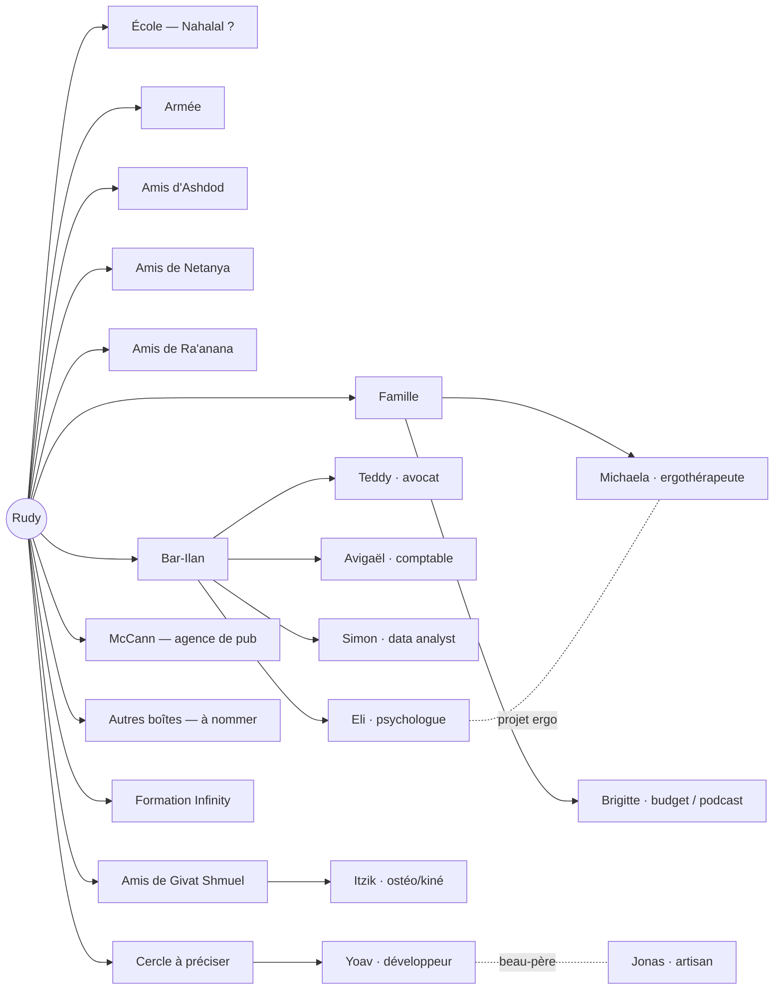

# Réseau

Cartographie des personnes connues, par cercle de vie. Objectif initial (2026-09-25) : repérer des associés potentiels pour des projets micro-SaaS.

## Graphe

## Cercles
| Cercle | Personnes | Statut |
|---|---|---|
| École (Nahalal ?) | — | nom à confirmer, à remplir |
| Armée | — | à remplir |
| Amis d'Ashdod | — | à remplir |
| Amis de Netanya | — | à remplir |
| Amis de Ra'anana | — | à remplir (jugé à fort potentiel) |
| Amis de Givat Shmuel | [[Itzik]] | commencé |
| Bar-Ilan | [[Teddy]], [[Avigaël]], [[Simon]], [[Eli]] | commencé (jugé à fort potentiel) |
| McCann | — | à remplir |
| Autres boîtes | — | noms à donner |
| Formation Infinity | — | à remplir |
| Famille | [[Brigitte]], [[Michaela]] | commencé |
| À préciser | [[Yoav]], [[Jonas]] | rattacher à un cercle |

## Associés potentiels
- **Experts métier :** [[Teddy]], [[Avigaël]], [[Eli]], [[Brigitte]], [[Michaela]], [[Jonas]], [[Itzik]]
- **Partenaires techniques :** [[Simon]], [[Yoav]]
